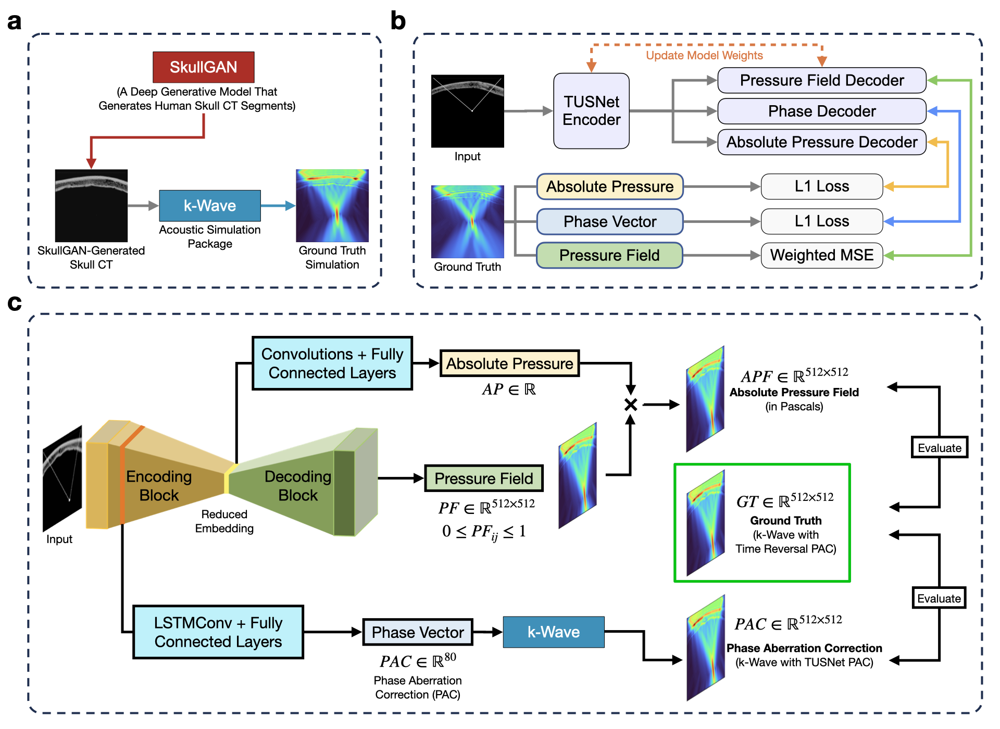

# TUSNet: A deep-learning model for one-shot transcranial ultrasound simulation and phase aberration correction

[Kasra Naftchi-Ardebili](https://bioengineering.stanford.edu/people/kasra-naftchi-ardebili)†, [Karanpartap Singh](https://karanps.com)†, Reza Pourabolghasem, Gerald R. Popelka, [Kim Butts Pauly](https://kbplab.stanford.edu).

† denotes equal contribution.

**Stanford University, Schools of Engineering and Medicine**

<hr>



We are excited to present TUSNet, the first end-to-end deep learning model capable of computing transcranial ultrasound pressure fields and phase aberration corrections with high accuracy and efficiency. Outperforming traditional methods like k-Wave by over 1200X, TUSNet achieves 98.3% accuracy in peak pressure estimation with a computation time of only 21 milliseconds, providing a fast and accurate solution for non-invasive ultrasound-based therapies.

## Abstract

Transcranial ultrasound (TUS) has emerged as a promising tool in clinical and research settings due to its potential to modulate neuronal activity, open the blood-brain barrier, facilitate targeted drug delivery via nanoparticles, and perform thermal ablation, all non-invasively. By delivering focused ultrasound waves to precise regions anywhere in the brain, TUS enables targeted energy deposition and is being explored in over fifty clinical trials as a treatment for conditions such as opioid addiction, Alzheimer’s disease, dementia, epilepsy, and glioblastoma. However, effective TUS treatment requires careful ultrasound parameter design and precise computation of the focal spot’s location and pressure, as skull heterogeneity increases the risk of off-target sonication or insufficient energy delivery to neural tissue. In clinical settings, this phase aberration correction must be computed within seconds. To achieve this, commercial devices often rely on faster methods, such as ray tracing, to predict the focus location and pressure. While computationally efficient, these methods may not always provide the high level of accuracy needed for optimal TUS delivery. We present TUSNet, the first end-to-end deep learning approach to solve for both the pressure field and phase aberration corrections without being bound to the inherent trade-off between accuracy and efficiency. TUSNet computes the 2D transcranial ultrasound pressure field and phase corrections within 21 milliseconds (over 1200X faster than k-Wave, a MATLAB-based acoustic simulation package), achieving 98.3% accuracy in estimating the peak pressure magnitude at the focal spot with a mean positioning error of only 0.18 mm compared to a ground truth from k-Wave.

## Getting Started

_Coming soon!_

## Datasets

A small subset of our primary training data is available [here](https://figshare.com/articles/dataset/TUSNet_Training_Simulations/28102640). The `inputs` consist of solely the Skull CT slices used for our simulations, while the `inputs_traced` contain these CTs plus the transducer and waveguides described in the paper (hence these samples comprise the complete input to the model), and finally the 'pfields' contain, in this order, the 512x512 pressure field, 80 dimensional phase correction vector, and scalar pressure field normalization factor (the maximum value present in the pressure field).

Along with this sample data, we are releasing the filtered SkullGAN synthetic skulls that we used to generate our training data [here](https://figshare.com/articles/dataset/SkullGAN_Filtered_Synthetic_Skulls/28102670). The scripts used to filter this data (where we used an MSE distance measure to remove similar skulls and yield a set of 3,222 samples with higher diversity) is published in this repository under `training_data/00 - Skull Filtering.ipynb`. Lastly, the k-Wave script we used to generate our simulations is located at `training_data/gen/tusnet_sims.m` in this repository. 

## Citation

If you found TUSNet helpful in your own work, please cite it using the following code:

```bibtex
@misc{TUSNet2024,
      title={A deep-learning model for one-shot transcranial ultrasound simulation and phase aberration correction}, 
      author={Kasra Naftchi-Ardebili and Karanpartap Singh and Gerald R. Popelka and Kim Butts Pauly},
      year={2024},
      eprint={2410.19995},
      archivePrefix={arXiv},
      primaryClass={physics.med-ph},
      url={https://arxiv.org/abs/2410.19995}, 
}
```
